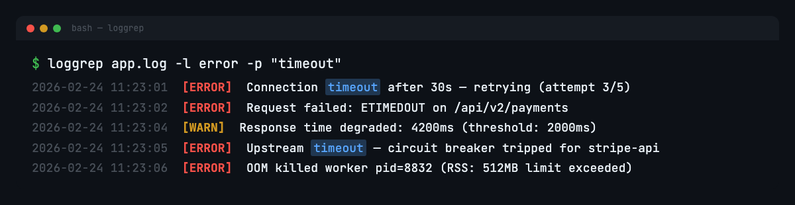
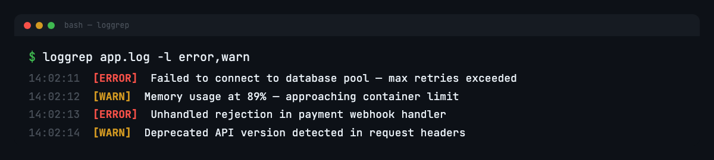
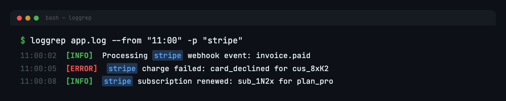
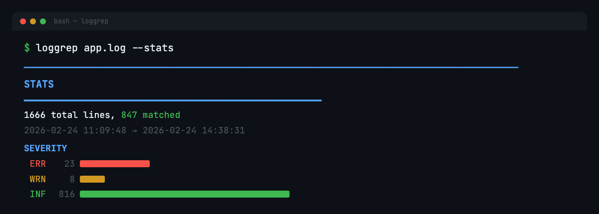
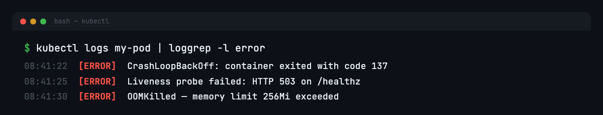

<p align="center">
  
</p>

<p align="center">
  
  
</p>

---



## What is this

A log parser for the terminal that does what you actually want. Color-codes severity levels, filters by time range, regex searches, gives you stats, handles JSON logs, and follows files in real-time.

## Install

**From source** (requires [Rust](https://rustup.rs/)):

```bash
git clone https://github.com/dyascj/loggrep-cli.git
cd loggrep-cli
cargo install --path .
```

**Prebuilt binaries** — grab the latest from [Releases](https://github.com/dyascj/loggrep-cli/releases).

## Usage

```bash
# just color-code a log file
loggrep app.log

# filter by severity
loggrep app.log -l error
loggrep app.log -l error,warn
loggrep app.log -l warn+             # warn and above

# regex search
loggrep app.log -p "timeout|OOM"

# time range
loggrep app.log --from "11:00" --to "12:00"

# combine filters
loggrep app.log -l error -p "stripe" --from "07:00" --to "15:00"

# stats summary
loggrep app.log --stats              # lines + stats
loggrep app.log -S                   # stats only

# follow mode (like tail -f with filtering)
loggrep app.log -f
loggrep app.log -f -l error

# pipe from stdin
kubectl logs my-pod | loggrep -p "timeout"
journalctl -f | loggrep -l warn+

# other stuff
loggrep app.log -c                   # count matches
loggrep app.log -l error --json      # output as JSON
loggrep app.log -v -p "healthcheck"  # invert match
loggrep app.log -n                   # line numbers
```

## Features

### Severity detection

Picks up log levels from `[ERROR]`, `level: error`, `{"level": "error"}`, and color-codes them automatically.



### Time ranges & regex

Handles bracketed datetimes, ISO 8601, syslog format, and JSON timestamp fields. The `--from` / `--to` flags are flexible. Combine with `-p` for regex pattern matching with highlighted results.

```
"2026-02-24 11:00:00"   full datetime
"2026-02-24"            date (starts at midnight)
"11:00"                 time (assumes today)
```



### Stats

Line counts, time span, severity breakdown, and top recurring errors.



### Pipes into anything

Works with stdin so you can pipe from `kubectl`, `journalctl`, `docker logs`, or anything else.



### Follow mode

Like `tail -f` but with all filtering and coloring applied. Uses filesystem events (kqueue/inotify) so it's not polling.

### JSON logs

Parses structured JSON logs (one object per line), extracts message/level/timestamp fields, and displays the rest as `key=value` pairs.

### Shell completions

Generate completions for your shell:

```bash
loggrep --completions bash > ~/.local/share/bash-completion/completions/loggrep
loggrep --completions zsh > ~/.zfunc/_loggrep
loggrep --completions fish > ~/.config/fish/completions/loggrep.fish
```

## License

MIT
